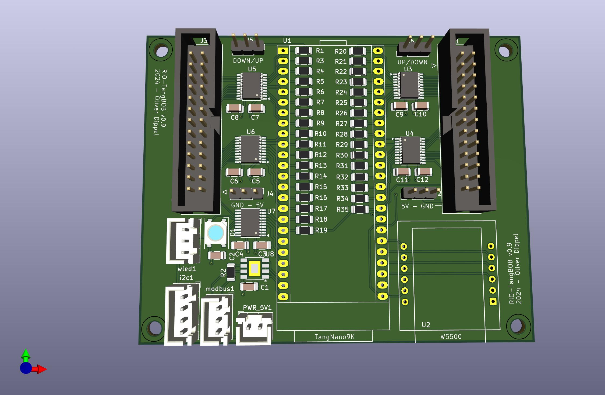

# TangBOB

cheap universal-board for LinuxCNC-RIO

**NOT ALL TESTED**

* W5500
* Level-Shifter (TXS0108E)
* RGB-LED
* Modbus
* I2C - 5V (hope this will work via the level-shifter)

Kicad-Footprint for the TangNano9K:

    https://github.com/jabadiagm/MSXmapper_tn9k/tree/main/kicad/t_mapper.pretty
